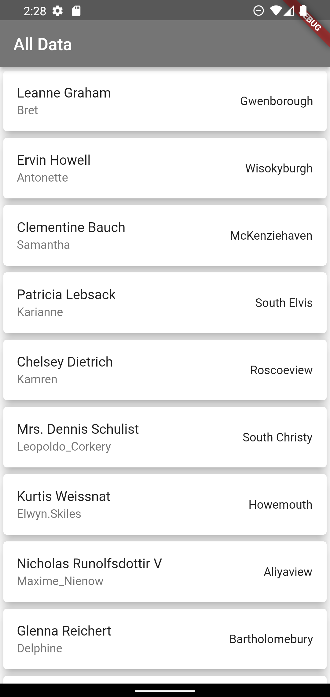
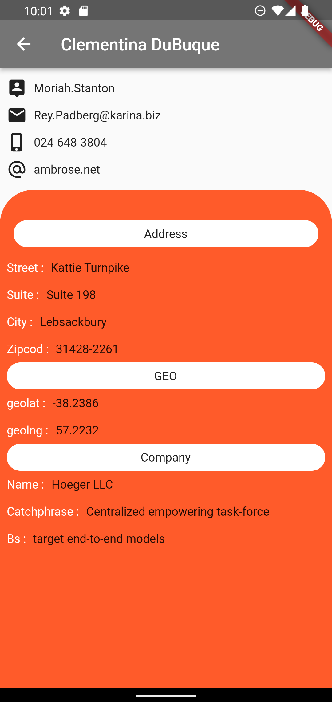

# data_from_api

Flutter project !!.
## Use Package
- json_annotation
- json_serializable
- build_runner
- dio

### _การทำงานของแอปพลิเคชัน_ 

       - การดึง API มาแสดง
       

### _รูปลักษณ์ภายในแอปพลิเคชัน_

### _หลังจากเลือก List รายการใดรายการหนึ่งจะแสดงข้อมูลของ List รายการนั้น_

